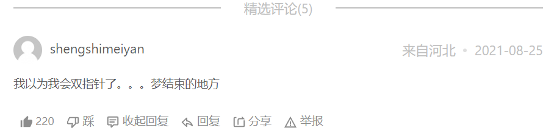

**注意**：双指针法 (快慢指针法) 在数组和链表的操作中是非常常见的，很多考察数组、链表、字符串等操作的面试题，都使用双指针法

## 27. 移除元素

*[LeetCode链接](https://leetcode.cn/problems/remove-element)*

### 题目大意

给定一个数组 nums 和一个数值 val，将数组中所有等于 val 的元素删除，并返回剩余的元素个数

不要使用额外的数组空间，你必须仅使用 O(1) 额外空间并 原地 修改输入数组

### 解题思路

**思路1：双指针 (快慢指针)**

由于题目要求删除数组中等于 val 的元素，因此输出数组的长度一定小于等于输入数组的长度，我们可以把输出的数组直接写在输入数组上

使用双指针(快慢指针)：快指针 fast 指向当前将要处理的元素，慢指针 slow 指向下一个将要赋值的位置

* 如果快指针指向的元素不等于 val，它一定是输出数组的一个元素，我们就将快指针指向的元素复制到慢指针位置，然后将快慢指针同时右移

* 如果快指针指向的元素等于 val，它不能在输出数组里，此时慢指针不动，快指针右移一位

这道题和第 283 题基本一致，283 题是删除 0，这一题是给定的一个 val，实质是一样的

### 代码实现

```go
// 使用双指针，用一层for循环做了两层for循环的事情(在一个数组上操作)
// 快指针 fast 指向当前将要处理的元素，慢指针 slow 指向下一个将要赋值的位置
// 时空复杂度O(n)、O(1)
func removeElement(nums []int, val int) int {
	slow := 0                                 // 慢指针slow是新数组的下标值
	for fast := 0; fast < len(nums); fast++ { // 快指针fast移动操作
		if nums[fast] != val {
			nums[slow] = nums[fast]   // 快指针的值赋给慢指针
			slow++
		}
	}
	return slow
}
```
for range 写法：(省略 fast 指针和 nums[fast]，用 for _, v) (Go特有)
```go
func removeElement(nums []int, val int) int {
    slow := 0
    for _, v := range nums { // v 即 nums[fast]
        if v != val {
            nums[slow] = v
            slow++
        }
    }
    return slow
}
```

**思路2：双指针优化**

如果要移除的元素恰好在数组的开头，例如序列 [1,2,3,4,5]，当 val 为 11 时，我们需要把每一个元素都左移一位。注意到题目中说：「元素的顺序可以改变」。实际上我们可以直接将最后一个元素 5 移动到序列开头，取代元素 1，得到序列 [5,2,3,4]，同样满足题目要求

**这个优化在序列中 val 元素的数量较少时非常有效**

实现方面，依然使用双指针，**两个指针初始时分别位于数组的首尾，向中间移动遍历该序列**

如果左指针 left 指向的元素等于 val，此时将右指针 right 指向的元素复制到左指针 left 的位置，然后右指针 right 左移一位。如果赋值过来的元素恰好也等于 val，可以继续把右指针 right 指向的元素的值赋值过来 (左指针 left 指向的等于 val 的元素的位置继续被覆盖)，直到左指针指向的元素的值不等于 val 为止

当左指针 left 和右指针 right 重合的时候，左右指针遍历完数组中所有的元素

这样的方法两个指针在最坏的情况下合起来只遍历了数组一次

与思路1 不同的是，思路2 **避免了需要保留的元素的重复赋值操作**

### 代码实现

```go
// 避免了需要保留的元素的重复赋值操作
func removeElement(nums []int, val int) int {
    left, right := 0, len(nums)
    for left < right {
        if nums[left] == val {
            nums[left] = nums[right-1]
            right--
        } else {
            left++
        }
    }
    return left
}
```

## 26. 删除有序数组中的重复项

*[LeetCode链接](https://leetcode.cn/problems/remove-duplicates-from-sorted-array)*

### 题目大意

给定一个有序数组 nums，对数组中的元素进行去重，使得原数组中的每个元素只有一个。最后返回去重以后数组的长度值

### 解题思路

这道题和第 283 题，第 27 题基本一致，283 题是删除 0，27 题是删除指定元素，这一题是删除重复元素，实质是一样的

**双指针 (快慢指针)**
* 使用双指针，一个指针slow始终指着已经排好的结果的数组的最后一位，一个指针fast始终往后移动
* 初始时第一位是不用去判断重复的，那么第一位就是已经排好的最后一个位置，初始slow的下标就是0，从第二才开始要去判断是否和前面的相同，所以移动的指针fast下标为1
* 如果slow所指向的元素和fast所指向的元素相同，fast继续往后走一个，如果fast所指向的值和slow所指向的值不同，此时fast指向的值应该排到slow所指向的值的后面，由于slow始终指向已经排好的数组的最后一个数组所以slow也需要加1，slow的位置到fast的位置这中间的相同的值是不需要的，fast加1继续下一轮判断，直到fast到达了数组末尾结束，最终slow也是指向已经排好的数组的最后一个值的下标，那么返回的个数就是slow+1


### 代码实现

```go
func removeDuplicates(nums []int) int {
	slow := 0
	for fast := 1; fast < len(nums); fast++ {
		if nums[fast] != nums[slow] {
			slow++
			nums[slow] = nums[fast]
		}
	}
	return slow + 1 // return slow我研究了几个小时才发现应该是slow+1
}
```
注意： `return slow + 1`

## 283. 移动零

*[LeetCode链接](https://leetcode.cn/problems/move-zeroes)*

### 题目大意

题目要求不能采用额外的辅助空间，将数组中 0 元素都移动到数组的末尾，并且维持所有非 0 元素的相对位置

### 解题思路

这一题可以只扫描数组一遍，不断的用 slow，fast 标记 0 和非 0 的元素，然后相互交换，最终到达题目的目的

与这一题相近的题目有第 26 题，第 27 题，第 80 题

### 代码实现

方法1：
```go
func moveZeroes(nums []int)  {
    slow := 0
    for fast := 0; fast < len(nums); fast++ {
        if nums[slow] == 0 {
            if nums[fast] != 0 {    
                nums[slow], nums[fast] = nums[fast], nums[slow]  // Go的独特交换方式
                slow++
            }
        } else {
            slow++
        }
    }
    // return nums[slow+1]
}
```
方法2：
```go
func moveZeroes(nums []int)  {
    slow := 0
    for fast := 0; fast < len(nums); fast++ {
        if nums[fast] != 0 {
	    if fast != slow {
	        nums[slow], nums[fast] = nums[fast], nums[slow]	  
	    } 
	slow++
}
```

这个加了会提高效率吗？

```go
if len(nums) == 0 {
	return
}
```

## *844.比较含退格的字符串

*[LeetCode链接](https://leetcode.cn/problems/backspace-string-compare/)*



### 题目大意

给 2 个字符串，如果遇到 # 号字符，就回退一个字符，问最终的 2 个字符串是否完全一致

注意：

* 如果对空文本输入退格字符，文本继续为空
* 1 <= s.length, t.length <= 200
* s 和 t 只含有小写字母以及字符 '#'

***进阶：**

你可以用 O(n) 的时间复杂度和 O(1) 的空间复杂度解决该问题吗？

答：双指针！可以维护两个计数器，记录下退格的个数，然后**倒序遍历**字符串来决定当前字符是否需要跳过，可能有些抽象

### 解题思路

**思路1：栈**

可以用栈的思想来模拟，遇到 '#' 字符就回退一个字符，不是 '#' 号就入栈一个字符，比较最终两个字符串即可。该思路需要定义两个切片模拟栈，空间复杂度O(n)

**思路2：双指针 (进阶)**

一个字符是否会被删掉，只取决于该字符后面的退格符，而与该字符前面的退格符无关。因此当我们**逆序**地遍历字符串，就可以立即确定当前字符是否会被删掉

具体地，我们定义 skip 表示当前待删除的字符的数量，每次我们遍历到一个字符

* 若该字符为退格符 '#'，则我们需要多删除一个普通字符，我们让 skip 加 1

* 若该字符为普通字符：

  * 若 skip 为 0，则说明当前字符不需要删去

  * 若 skip 不为 0，则说明当前字符需要删去，我们让 skip 减 1

这样，我们定义两个指针，分别指向两字符串的末尾。每次我们让两指针逆序地遍历两字符串，直到两字符串能够各自确定一个字符，然后将这两个字符进行比较。重复这一过程**直到找到的两个字符不相等**，或**遍历完字符串**为止，该思路不需要额外存储空间，空间复杂度O(1)

### 代码实现

#### **思路1：栈**

```go
func backspaceCompare(s string, t string) bool {
    return build(s) == build(t)
}
// 新建一个build函数，内部实现函数创建
func build(str string) string {
    s := make([]byte, 0)     // 用str[i]索引时用byte类型，直接索引v用rune
    // s := []byte{}         // 官方题解的写法
    // s := make([]rune, 0)  // 此处用rune时，第11行报错：cannot use str[i] (type byte) as type rune in append (solution.go)
    for i := range str {     // 省略索引值，只使用索引i的for range写法，s要定义为byte
        if str[i] != '#' {
            s = append(s, str[i])
        } else if len(s) > 0 {
            s = s[:len(s)-1]  // 相当于 s 出栈一个元素 (字符)
        } 
    }
    /* 另一种省略索引的for range写法，s要定义为rune
    for _, v := range str {
        if v != '#' {
            s = append(s, v)
        } else if len(s) > 0 {
            s = s[:len(s)-1]
        }
    } */
    return string(s) // byte 类型强转为 string
}
```

```go
注意：
1. byte和rune类型：用str[i]索引时用byte类型，直接索引v用rune
2. for range的两种写法：for i := range str 和 for _, v := range str
3. s = s[:len(s)-1]  // 相当于 s 出栈一个元素
```

> rune是Go语言中一种特殊的数据类型，它是int32的别名，几乎在所有方面等同于int32，用于区分字符值和整数值
>当需要处理中文、日文或者其他复合字符时，需要用到rune类型

> **补充：Go中的字符有两种，uint8 (byte) 代表 ASCII 的一个字符，rune代表一个 utf-8 字符**

#### **思路2：双指针**

```go
func backspaceCompare(s string, t string) bool {
    i, j := len(s)-1, len(t)-1
    skipS, skipT := 0, 0
    for i >= 0 || j >= 0 {  // 注意>=
        for i >= 0 {
            if s[i] == '#' {
                skipS++
                i--       // 忘记写i--，导致遇到 '#' 循环一直无法终止，导致runtime error
            } else if skipS > 0 {
                skipS--
                i--
            } else {
                break     // 不加break会继续循环，不会跳出
            }
        }
        for j >= 0 {
            if t[j] == '#' {
                skipT++        
                j--       // 忘记写j--，导致遇到 '#' 循环一直无法终止，导致runtime error
            } else if skipT > 0 {
                skipT--
                j--
            } else {
                break     // 不加break会继续循环，不会跳出
            }
        }
        if i >= 0 && j >= 0 {  // 注意 i，j都 >=，代表两个元素可以比较
            if s[i] != t[j] {
                return false
            } 
        } else if i >= 0 || j >= 0 {  // else if后用 ||，代表有一个<0，长度不等一定是false
            return false
        }
        i--
        j--                   // 注意在判断所有除了false的情况都需要i--， j--，所以写在if外
    }
    return true
}
```

```go
注意：
1. if s[i] == '#'的判断中忘记写i--，导致遇到'#'循环一直无法终止，报错runtime error
} 
2. 不加break会继续循环，不会跳出
3. 在判断所有除了false的情况都需要i--， j--，所以写在if外
```

### 复杂度分析

思路1 (栈实现)
* 时间复杂度：O(N+M) -> O(n)，其中 N 和 M 分别为字符串 s 和 t 的长度，我们需要遍历两字符串各一次

* 空间复杂度：O(N+M) -> O(n)，其中 N 和 M 分别为字符串 s 和 t 的长度，主要为还原出的字符串的开销

思路2 (双指针实现)

* 时间复杂度：O(N+M) -> O(n)，其中 N 和 M 分别为字符串 s 和 t 的长度，我们需要遍历两字符串各一次

* **空间复杂度：O(1)**，对于每个字符串，我们只需要定义一个指针和一个计数器即可